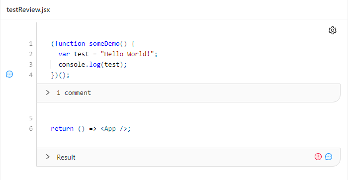

# react-code-review-editor
The react-code-review-editor is a React component aiming to provide functionality for code review purposes.
It supports a variety of languages.



##Features
- [x] display syntax highlighted code 
- [x] create and display comments inside the code 
- [x] create and display results
- [x] different comment types with their own annotation symbols for better usability
- [x] keyboard shortcuts 

##Development
For using and getting to know the component through storybook examples:
```shell script
git clone https://github.com/codefreak/react-code-review-editor.git
yarn install
yarn storybook
```

## How to import to your own project (while not published on npm)
* clone this repo
* run `yarn build`
* this builds and packages the `./lib`
* in your repo that you want to use the library in type `npm i local/path/to/the/package.tgz`
* the library has been added to your `package.json` and `node_modules` folder and can now be used

## License
The source code for all packages in ./src is licensed under the MIT license, which you can find in the LICENSE 
file.